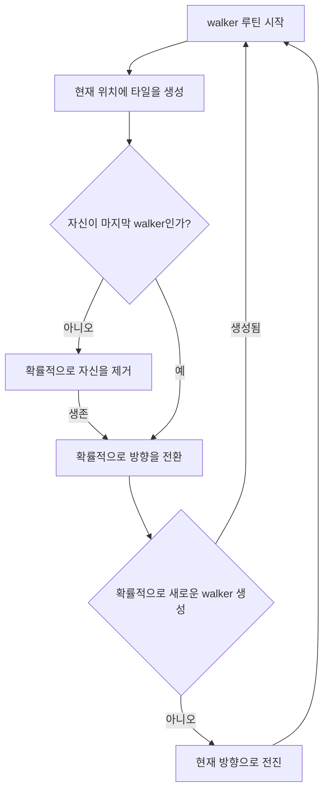

## Resources
#### Resources.Load
- Resources 이름의 directory에 있는 파일을 코드를 통해 로드할 수 있다   
- path는 Resources directory의 상대 경로이며 Resources directory는 여러개를 사용할 수 있다 (Map/Resources, Character/Resources)   
- path의 파일 이름에는 확장자를 쓰지 않아야 하고 같은 이름의 다른 파일이 있을 경우 generic을 사용한다 (Resources.Load\<T\>(path))   
```C#
		//Load a Texture (Assets/Resources/Textures/texture01.png)
		var texture = Resources.Load<Texture2D>("Textures/texture01");
	  // Instantiates a Prefab named "enemy" located in any Resources folder in your project's Assets folder.
		GameObject instance = Instantiate(Resources.Load("enemy", typeof(GameObject))) as GameObject;
```
## Tile map generate
#### Map walker
- 랜덤성을 사용해 타일 맵을 생성하는 알고리즘   
- walker라는 개체들을 만들어 랜덤성에 의해 시작지점에서부터 인접 지역들에 임의의 타일을 배치한다   
- 다음은 하나의 walker의 루틴이다   


#### map generator
- map walker들을 관리하며 정해진 크기의 타일 맵을 생성한다   
- walker를 이용해 정해진 비율까지 맵에 타일을 배치하고 필요시 배치된 타일 외곽에 벽을 배치한다   

> **읽어 볼 내용**   
- [Random walk](https://en.wikipedia.org/wiki/Random_walk)   
     